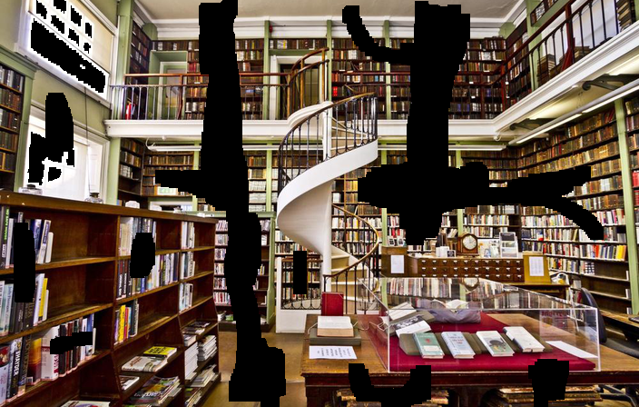

# deep-image-prior-tensorflow

A tensorflow implement of the inpainting module in deep-image-prior. https://dmitryulyanov.github.io/deep_image_prior

## Input

## Output

## Reference
1.Ulyanov D, Vedaldi A, Lempitsky V. Deep image prior[J]. arXiv preprint arXiv:1711.10925, 2017.
